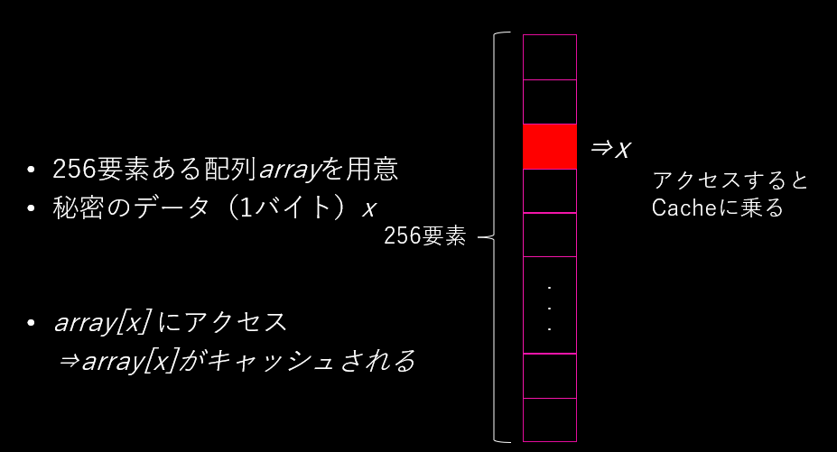
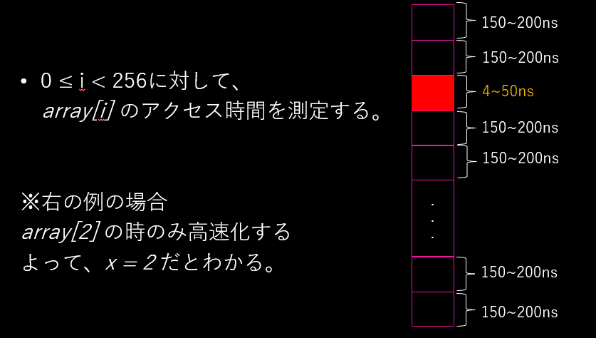
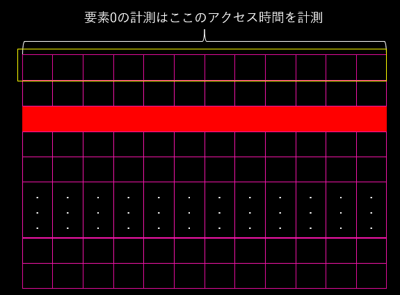
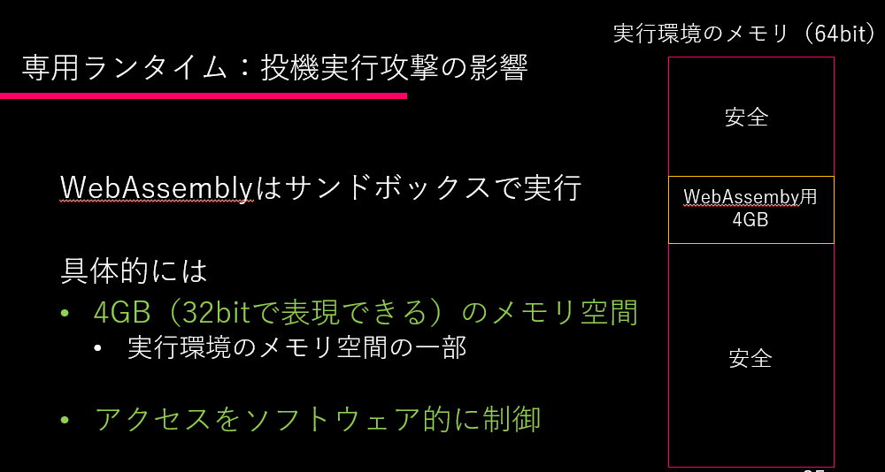
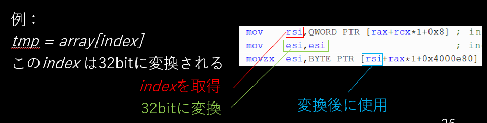
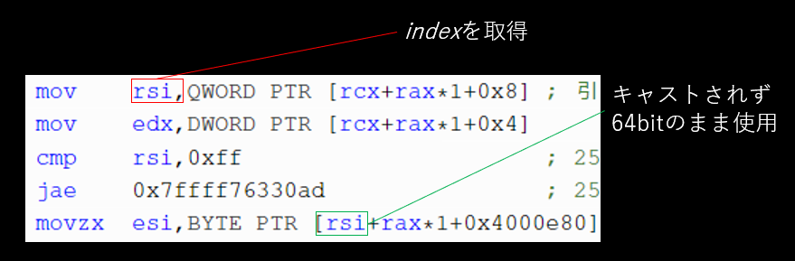

# WebAssemblyを使ったSpectre攻撃の有効性
ここではポスターに載せきれなかった細かい話を書きます。

## 実験に使ったランタイム
[Wasmer](https://github.com/wasmerio/wasmer)

## キャッシュタイミング攻撃の実装
キャッシュタイミング攻撃は以下のように実装します。ここでは読み取りたいデータ（１バイト）を`x`とし、これを直接読み取ることなく特定します。まず、要素が256個（256は1バイトの表せる範囲）ある配列`array`を用意します。ここで、一度`array[x]`にアクセスし`array[x]`をキャッシュさせます。このとき`array[x+1]`以降が間違ってキャッシュされないように、１要素のサイズを大きくする必要があります（4096バイト程度あれば大丈夫）。



その後、`array`の全要素に対してアクセス時間の測定を行います。すると、一要素だけアクセス時間が速くなります。以下の例だと`x=2`の時に高速化しています。よって、最初にアクセスした`array[x]`の`x`の値は`2`であったと特定できる、という仕組みです。



```
if(x < array1_size){
    tmp = array2[array1[x]];
}
```


### ブラウザにおけるキャッシュタイミング攻撃の実装
まず前提として、WebAssemblyで使える機能は基本的にAPIとしてランタイムから与えられます。ブラウザでWebAssemblyを動かす場合はJavaScriptエンジン内で実行されるので、WebAssemblyが使える機能は最大でもJavaScriptが使える機能までということになります。なのでWebAssemblyでのキャッシュタイミング攻撃に使えるタイマーは、JavaScriptの`performance.now()`など既存の関数となります。実はSpectreが登場したときにすでにブラウザにおけるSpectre攻撃が問題となり、主要なブラウザでは`performance.now()`などのタイマー系の機能を持つ関数は精度が下げられています。ということで、すでに対策が入っているという現状に対し、本当にそれで大丈夫なのかを確かめるというのが目的となります。

ちなみに精度はchromeで100μs、firefoxで1ms単位の精度となっています。firefoxでは`about:config`から`privacy.reduceTimerPrecision`という項目を`false`にすることで10μs単位の精度に上げることができます。今回は精度を上げたfirefoxで実験しました（これでできなければ安全なので）。

では精度はこれで十分かというと、全然そんなことはありません。CPUのキャッシュミス・ヒットの差はナノ秒単位の差なので、10μs単位のタイマーで測定するにはそれぞれのアクセス時間の差を1000倍程度にする必要があります。そこで、特定対象のデータを1000回ほどキャッシュさせておけばできるのでは？と思い、要素が256個ある配列を1000個用意し、全配列の要素`x`に対してアクセスするという実装を考えました。計測時も全ての配列の同じ添え字の要素に対して測定すれば1000倍になるのでは？と思ったからです。



しかし、この方法はうまくいきませんでした。理由はキャッシュラインの使い過ぎです。一般的なパソコンのキャッシュラインはL1, L2合わせて4000とか5000程度なので、`x`の値が6以上であれば要素0～5までの計測時にキャッシュラインが上書きされてしまい、`x`の測定時には`x`がキャッシュラインに乗っていない状態になるからです。

これを何とかするには要素数を256から減らす必要があります。そこで次に考えたのが1bitを特定する方法でした。これなら要素数が`0`と`1`の2つだけでいいので改善されます。結果、これによって有意な結果が得られ、`0`の特定は93.2%、`1`の特定は81.2%となりました。`1`の特定率が悪い理由は`0`の特定から行っているからで、`0`のアクセス測定時に`1`をキャッシュラインから追い出しているのでは？と考えています。ただいずれも1/2の特定をしているだけなので、決して高い特定率ではないことに注意してください。

## 専用ランタイムでの発見
Wasmerでは高精度なタイマーが使えたため、特に苦労せずにキャッシュタイミング攻撃の再現ができました。ではSpectreができたとして影響範囲がどの程度あるのでしょうか。（Spectreの詳細は[この記事](https://milestone-of-se.nesuke.com/sv-advanced/sv-security/meltdown-spectre/)が分かりやすいです）

WebAssemblyはサンドボックス化されたメモリ内で実行されるます。具体的にはランタイムのメモリ空間から最大4GBが与えられ、そこが使用されます。つまりそれ以外の領域はwasmプログラムから読み取られることを想定していません。



実際、wasmバイナリによって生成された機械語の、メモリアクセス命令のアドレスとして使われる値は必ず32bitに変換されます。
```
unsigned long long index;
.
.
.
tmp = array[index];
```



しかし一定条件のときに、`index`が32bitに変換されないケースが見つかりました。
* `index`が条件分岐で32bit以下であることが保証されている場合
* wasmバイナリの無駄な処理を手作業で消してあげた場合
* バックエンドコンパイラにLLVMを使用した場合

以上の条件の時、最適化によって32bitへの変換処理が省略されました。



普通に考えれば特に問題なさそうな挙動ですが、Spectreは**分岐予測ミスによる投機実行でキャッシュさせる**ので、この仕様を悪用することができます。つまり任意の64bitの値を投機実行時にはメモリアクセス命令のアドレスとして使うことができるので、**攻撃者はランタイムのメモリ空間全体を攻撃対象とすることができる**ということになります。

### WebAssemblyから生成された機械語を見る方法
wasmバイナリをランタイムに渡して実行すると、バックエンドコンパイラによってネイティブの機械語に変換されてから実行されます。少しニッチな話になりますが、ここではどのように変換された機械語を取得したか説明します。（専用ランタイムのみ）

具体的にはGDBでデバッグしながら、生成されたタイミングでダンプします。GDBには[GEF](https://github.com/hugsy/gef)などのプラグインを入れておくと使いやすいです。
まず専用ランタイムで実行するコマンドをGDBに渡してデバッグします。
```
gdb wasmer run --llvm spectre.wasm```

